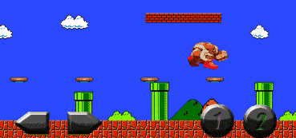
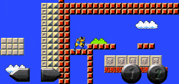
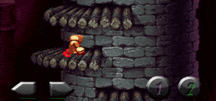
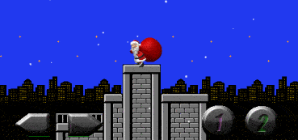
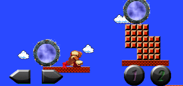
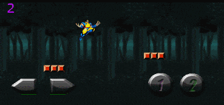

# 2D Game Engine

### About:
An HTML5 2D Game Engine.

### Sample projects utilizing the engine

  

  

  

### Features:
- Platform-independent engine
- Designed and implemented in plain Javascript from scratch
- Features collision detection, physics, animated graphics, desktop and mobile controls, resize to fit user device's dimensions, etc.
- Makes use of several design patterns like Decorator, Factory, Pub/Sub, Observer, Facade, Prototype and others

### Mario-style Sample:
- The engine comes with a sample mario-style platformer
- Use arrow keys ← ↑ → or the provided touchscreen controller to move the character
- The demo features one level as proof of concept only

### Graphics:
- All graphics belong to their appropriate copyright holders
- The material is presented for entirely non-profit educational demo purposes

### Demo
